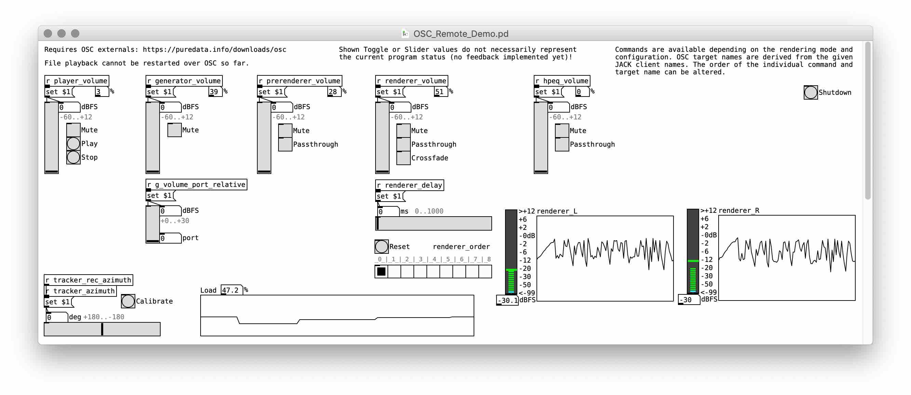

# ReTiSAR
Implementation of the Real-Time Spherical Microphone Renderer for binaural reproduction in _Python_ [[1]](#references).

##### Table of Contents:
1. [Requirements](#requirements)
2. [Setup](#setup)
3. [Quickstart](#quickstart)
4. [Execution parameters](#execution-parameters)
5. [Execution modes](#execution-modes)
6. [Remote Control](#remote-control)
7. [Validation - Setup and Execution](#validation---setup-and-execution)
8. [Benchmark - Setup and Execution](#benchmark---setup-and-execution)
9. [References](#references)
10. [Changelog](#changelog)
11. [Contributing](#contributing)
12. [Credits](#credits)
13. [License](#license)

## Requirements
* _MacOS_ (other OS not tested)
* [_JACK_ library](http://jackaudio.org/downloads/) (on _MacOS_ the prebuilt binary works best)
* [_Conda_ installation](https://conda.io/en/master/miniconda.html) (`miniconda` is enough, highly recommended to get [Intel _MKL_](https://software.intel.com/en-us/articles/using-intel-distribution-for-python-with-anaconda) or alternatively [_OpenBLAS_](https://github.com/conda-forge/openblas-feedstock) optimized `numpy` version, automatically done in [setup section](#setup))
* [_Python_ installation](https://www.python.org/downloads/), recommended way is to use _Conda_ (automatically done in [setup section](#setup))
* Installation of the required _Python_ packages (see [setup section](#setup))
* __Optional:__ Download of publicly available measurement data for alternative [execution modes](#execution-modes
) (always check `command line` output or log files in case the rendering pipeline does not initialize successfully!)
* __Optional:__ [_OSC_ client](http://opensoundcontrol.org/implementations) (see [remote control section](#remote-control))

## Setup
* Clone repository with command line or any other _git_ client 
`git clone https://github.com/AppliedAcousticsChalmers/ReTiSAR.git`
  * __Alternative:__ Download and extract snapshot manually from provided URL (not recommended due to not being able to pull updates) 
* Navigate into repository (the directory containing _setup.py_) 
`cd ReTiSAR/`
* Make sure that _Conda_ is up to date 
`conda update conda`
* Create new _Conda_ environment from the specified requirements (`--force` to overwrite potentially existing outdated environment) 
`conda env create --file environment.yml --force`
* Activate created _Conda_ environment 
`source activate ReTiSAR`

## Quickstart
* Run package with __[default]__ parameters 
`python -m ReTiSAR`
* __Option 1:__ Modify configuration by changing default parameters in [config.py](ReTiSAR/config.py) (prepared block
 comments for the specific execution modes below exist).
* __Option 2:__ Modify configuration by command line arguments (like in the following examples showing different
 execution [parameters](#execution-parameters) and [modes](#execution-modes) (see `--help`).

__JACK initialization --__ In case you have never started the _JACK_ audio server on your system or want to make sure it initializes with appropriate values. Open the _JackPilot_ application set your system specific default settings. 
At this point the only relevant _JACK_ audio server setting is the sampling frequency, which has to match the sampling frequency of your rendered audio source file or stream (no resampling will be applied for that specific file).

__FFTW optimization --__ In case the rendering takes very long to start (after the message _"initializing FFTW DFT optimization ..."_), you might want to endure this long computation time once (per rendering configuration) or lower your [FFTW](http://www.fftw.org/fftw3_doc/Planner-Flags.html) planner effort (see `--help`).

__Rendering performance --__ Follow these remarks to expect continuous and artifact free rendering:
  * Optional components like array pre-rendering, headphone equalization, noise generation, etc. will save   performance in case they are not deployed.
  * Extended IR lengths (particularly for modes with array IR pre-rendering) will massively increase the computational load depending on the chosen block length (partitioned convolution).
  * Currently there is no partitioned convolution for the main binaural renderer with SH based processing, hence the FIR taps of applied HRIR, Modal Radial Filters and further compensations (e.g. Spherical Head Filter) need to cumulatively fit inside the chosen block length.
  * Higher block length means lower computational load in real-time rendering but also increased system latency, most relevant for modes with array live-stream rendering, but also all other modes in terms of a slightly "smeared" head-tracking experience (noticeable at 4096 samples).
  * Adjust output levels of all rendering components (default parameters chosen accordingly) to prevent signal clipping (indicated by warning messages during execution).
  * Check _JACK_ system load (e.g. _JackPilot_ or [OSC_Remote_Demo.pd](#remote-control)) to be below approx. 95% load, in order to prevent dropouts (i.e. the OS reported overall system load is not a good indicator).
  * Check _JACK_ detected dropouts ("xruns" indicated during execution).
  * Most of all, use your ears! If something sounds strange, there is probably something going wrong... ;)

__Always check the command line output or generated log files in case the rendering pipeline does not initialize successfully!__

## Execution parameters
The following parameters are all optional and available in combinations with the named execution modes subsequently: 
* Run with specific processing block size (_choose value according to the individual rendering configuration and performance of your system_) 
  * Largest block size (best performance but noticeable input latency): 
  `python -m ReTiSAR -b=4096` __[default]__ 
  * Try smaller block sizes __according to the specific rendering configuration and individual system performance__: 
  `python -m ReTiSAR -b=1024` 
  `python -m ReTiSAR -b=256`
* Run with specific processing word length 
  * Single precision _32 bit_ (better performance): 
  `python -m ReTiSAR -SP=TRUE` __[default]__ 
  * Double precision _64 bit_ (no configuration with an actual benefit is known): 
  `python -m ReTiSAR -SP=FALSE`
* Run with specific IR truncation cutoff level (applied to all IRs) 
  * Cutoff _-60 dB_ under peak (better performance and perceptually irrelevant in most cases): 
  `python -m ReTiSAR -irt=-60` __[default]__ 
  * No cutoff to render entire IR (tough performance requirements in case of rendering particularly reverberant array IRs): 
  `python -m ReTiSAR -irt=0` __[applied in all scientific evaluations]__
* Run with specific head-tracking device (paths are system dependent!) 
  * No tracking (head movement can be [remote controlled](#remote-control)): 
  `python -m ReTiSAR -tt=NONE` __[default]__ 
  * Automatic rotation: 
  `python -m ReTiSAR -tt=AUTO_ROTATE` 
  * Tracker _Razor AHRS_: 
  `python -m ReTiSAR -tt=RAZOR_AHRS -t=/dev/tty.usbserial-AH03F9XC` 
  * Tracker _Polhemus Patriot_: 
  `python -m ReTiSAR -tt=POLHEMUS_PATRIOT -t=/dev/tty.UC-232AC` 
  * Tracker _Polhemus Fastrack_: 
  `python -m ReTiSAR -tt=POLHEMUS_FASTRACK -t=/dev/tty.UC-232AC`
* Run with specific HRTF dataset as _MIRO_ [[5]](#references) or _SOFA_ [[6]](#references) files 
  * _Neumann KU100_ artificial head from [[5]](#references) as _SOFA_: 
  `python -m ReTiSAR -hr=res/HRIR/KU100_THK/HRIR_L2702.sofa -hrt=HRIR_SOFA` __[default]__ 
  * _Neumann KU100_ artificial head from [[5]](#references) as _MIRO_: 
  `python -m ReTiSAR -hr=res/HRIR/KU100_THK/HRIR_L2702_struct.mat -hrt=HRIR_MIRO` 
  * _FABIAN_ artificial head from [[7]](#references) as _SOFA_: 
  `python -m ReTiSAR -hr=res/HRIR/FABIAN_TUB/FABIAN_HRIR_measured_HATO_0.sofa -hrt=HRIR_SOFA`
* Run with specific headphone equalization / compensation filters (arbitrary filter length). The compensation filter should match the utilized individual headphone (model)! In the best case scenario, the filter was also gathered on the identical utilized HRIR (artificial or individual head)! 
  * No individual headphone compensation:
  `python -m ReTiSAR -hp=NONE` __[default]__ 
  * _Sennheiser HD600_ headphone on _GRAS KEMAR_ artificial head:
  `python -m ReTiSAR -hp=res/HpIR/KEMAR_TUR/hpComp_HD600_1Filter.wav` 
* Run with specific SH processing compensation techniques (relevant for rendering modes utilizing spherical harmonics) 
  * __Modal Radial Filters__ __[always applied]__ with individual amplification soft-limiting in dB according to [[2 ]](#references): 
  `python -m ReTiSAR -arr=18` __[default]__ 
  * __Spherical Head Filter__ according to [[3]](#references): 
  `python -m ReTiSAR -sht=SHF` 
  * __Spherical Harmonics Tapering__ in combination with __Spherical Head Filter__ according to [[4]](#references): 
  `python -m ReTiSAR -sht=SHT+SHF` __[default]__
* Run with specific emulated self-noise as additive component to each microphone array sensor (performance requirements increase according to channel count) 
  * No noise (best performance): 
  `python -m ReTiSAR -gt=NONE` __[default]__ 
  * White noise (also setting the initial output level and mute state of the rendering component): 
  `python -m ReTiSAR -gt=NOISE_WHITE -gl=-30 -gm=FALSE` 
  * Pink noise by IIR filtering (higher performance requirements): 
  `python -m ReTiSAR -gt=NOISE_IIR_PINK -gl=-30 -gm=FALSE` 
* For further [configuration parameters](#execution-parameters), check __Alternative 1__ and __Alternative 2__ above.

## Execution modes
This section list all the conceptually different rendering modes of the pipeline. Most of the other beforehand introduced [execution parameters](#execution-parameters) can be combined with the mode-specific parameters. In case no manual value for all specific rendering parameters is provided (as in the following examples), their respective default values will be used.

__Most execution modes require additional external measurement data, which cannot be republished here.__ However, all provided examples are based on publicly available research data. Respective files are represented here by provided  source reference files (see [res/](res/.)), containing a source URL and potentially further instructions. In case the respective resource data file is not yet available on your system, download instructions will be shown in the command line output and generated log files.

* Run as array recording renderer, e.g. _Eigenmike_ at Chalmers lab space 
  * __Speaker moving horizontally around the array:__ 
  `python -m ReTiSAR -sh=4 -tt=NONE -s=res/record/EM32ch_lab_voice_around.wav -ar=res/ARIR/RT_calib_EM32ch_struct.mat -art=AS_MIRO -arl=0 -hr=res/HRIR/KU100_THK/HRIR_L2702.sofa -hrt=HRIR_SOFA` __[default]__ 
  * Speaker moving vertically in front of the array: 
  `python -m ReTiSAR -sh=4 -tt=NONE -s=res/record/EM32ch_lab_voice_updown.wav -ar=res/ARIR/RT_calib_EM32ch_struct.mat -art=AS_MIRO -arl=0 -hr=res/HRIR/KU100_THK/HRIR_L2702.sofa -hrt=HRIR_SOFA`
* Run as array live-stream renderer with minimum latency, e.g. _Eigenmike_ with the respective channel calibration (provided by manufacturer) 
  * Chalmers _EM32 (SN 28)_ calibration: 
  `python -m ReTiSAR -b=256 -sh=4 -tt=NONE -s=None -ar=res/ARIR/RT_calib_EM32ch_struct.mat -art=AS_MIRO -arl=0 -hr=res/HRIR/KU100_THK/HRIR_L2702.sofa -hrt=HRIR_SOFA` 
  * Facebook Reality Labs _EM32 (SN ??)_ calibration: 
  `python -m ReTiSAR -b=256 -sh=4 -tt=NONE -s=None -ar=res/ARIR/RT_calib_EM32frl_struct.mat -art=AS_MIRO -arl=0 -hr=res/HRIR/KU100_THK/HRIR_L2702.sofa -hrt=HRIR_SOFA`

* Run as array IR renderer, e.g. _Eigenmike_ 
  * Simulated plane wave: `python -m ReTiSAR -sh=4 -tt=AUTO_ROTATE -s=res/source/Drums_48.wav -ar=res/ARIR/DRIR_sim_EM32_PW_struct.mat -art=ARIR_MIRO -arl=-6 -hr=res/HRIR/KU100_THK/HRIR_L2702.sofa -hrt=HRIR_SOFA` 
  * Anechoic measurement: `python -m ReTiSAR -sh=4 -tt=AUTO_ROTATE -s=res/source/Drums_48.wav -ar=res/ARIR/DRIR_anec_EM32ch_S_struct.mat -art=ARIR_MIRO -arl=0 -hr=res/HRIR/KU100_THK/HRIR_L2702.sofa -hrt=HRIR_SOFA`
* Run as array IR renderer, e.g. sequential VSA measurements from [[8]](#references) at the maximum respective SH order 
  * 50ch (sh5), SBS center: 
  `python -m ReTiSAR -sh=5 -tt=AUTO_ROTATE -s=res/source/Drums_48.wav -ar=res/ARIR/DRIR_SBS_VSA_50RS_PAC.sofa -art=ARIR_SOFA -arl=-12 -hr=res/HRIR/KU100_THK/HRIR_L2702.sofa -hrt=HRIR_SOFA` 
  * 86ch (sh7), LBS center: 
  `python -m ReTiSAR -sh=7 -tt=AUTO_ROTATE -s=res/source/Drums_48.wav -ar=res/ARIR/DRIR_LBS_VSA_86RS_PAC.sofa -art=ARIR_SOFA -arl=-12 -hr=res/HRIR/KU100_THK/HRIR_L2702.sofa -hrt=HRIR_SOFA` 
  * 110ch (sh8), CR1 left: 
  `python -m ReTiSAR -sh=8 -tt=AUTO_ROTATE -s=res/source/Drums_48.wav -sp="[(-37,0)]" -ar=res/ARIR/DRIR_CR1_VSA_110RS_L.sofa -art=ARIR_SOFA -arl=-12 -hr=res/HRIR/KU100_THK/HRIR_L2702.sofa -hrt=HRIR_SOFA` 
  * 1202ch (truncated sh12), CR1 left: 
  `python -m ReTiSAR -sh=12 -tt=AUTO_ROTATE -s=res/source/Drums_48.wav -sp="[(-37,0)]" -ar=res/ARIR/DRIR_CR1_VSA_1202RS_L.sofa -art=ARIR_SOFA -arl=-12 -hr=res/HRIR/KU100_THK/HRIR_L2702.sofa -hrt=HRIR_SOFA`

* Run as BRIR renderer (partitioned convolution in frequency domain) for any BRIR compatible to the _SoundScape Renderer_, e.g. pre-processed array IRs by [[9]](#references) 
`python -m ReTiSAR -tt=AUTO_ROTATE -s=res/source/Drums_48.wav -art=NONE -hr=res/HRIR/KU100_THK/BRIR_CR1_VSA_110RS_L_SSR_SFA_-37_SOFA_RFI.wav -hrt=BRIR_SSR -hrl=-12`
* Run as "binauralizer" for an arbitrary number of virtual sound sources via HRTF (partitioned convolution in frequency domain) for any HRIR compatible to the _SoundScape Renderer_ 
`python -m ReTiSAR -tt=AUTO_ROTATE -s=res/source/PinkMartini_Lilly_44.wav -sp="[(30, 0),(-30, 0)]" -art=NONE -hr=res/HRIR/FABIAN_TUB/hrirs_fabian.wav -hrt=HRIR_SSR` (provide respective source file and source positions!)

## Remote Control
* Certain parameters of the running real-time application can be remote controlled via _Open Sound Control_. Individual clients can be accessed by targeting them with specific _OSC_ commands on port `5005` __[default]__. 
Depending on the current configuration and rendering mode different commands will be available, i.e. arbitrary combinations of the following targets and values: 
`/generator/volume 0`, `/generator/volume -12`,  
`/prerenderer/mute 1`, `/prerenderer/mute 0`, `/prerenderer/mute -1`, `/prerenderer/mute`,  
`/hpeq/passthrough true`, `/hpeq/passthrough false`, `/hpeq/passthrough toggle`
* The target name is derived from the individual _JACK_ client name for all commands, while the order of target client and command can be altered. Additional commands might be available. 
`/renderer/crossfade`, `/crossfade/renderer`, `/renderer/delay 350.0`,  
`/renderer/order 0`, `/renderer/order 1`, `/renderer/order 4`,  
`/tracker/zero`, `/tracker/azimuth 45`, `/player/stop`, `/player/play`, `/quit`
* The individual _JACK_ client with its respective (target) name also reports real-time feedback or analysis data on port `5006` __[default]__ in the specified exemplary data format (number of values depends on output ports), i.e. arbitrary combinations of the name and parameters: 
`/player/rms 0.0`, `/generator/peak 0.0 0.0 0.0 0.0`, `/renderer/load 100`,  
also `/tracker/AzimElevTilt 0.0 0.0 0.0` (current head orientation) 
and `/load 100` (current JACK system load)
* In the package included is an example remote control client implemented for [_"vanilla" PD_](http://puredata.info/), see further instructions in [OSC_Remote_Demo.pd](res/OSC_Remote_Demo.pd).

## Validation - Setup and Execution
* Download and build required [_ecasound_ library](https://ecasound.seul.org/ecasound/download.php) for signal playback and capture __with _JACK_ support__ 
in directory `./configure`, `make` and `sudo make install` while having _JACK_ installed
* __Optional:__ Install [_sendosc_](https://github.com/yoggy/sendosc) tool to be used for automation in shell scripts 
`brew install yoggy/tap/sendosc`
* __Remark:__ Make sure all subsequent rendering configurations are able to start up properly before recording starts (particularly FFTW optimization might take a long time, see above)
* Validate impulse responses by __comparing against a reference implementation__, in this case the output of [_sound_field_analysis-py_](https://nbviewer.jupyter.org/github/AppliedAcousticsChalmers/sound_field_analysis-py/blob/master/examples/Exp4_BinauralRendering.ipynb) [[8]](#references)
  * Execute recording script, consecutively starting the package and capturing impulse responses in different rendering configurations 
  `./res/research/validation/record_ir.sh` 
  __Remark:__ Both implementations compensate the source being at an incidence angle of -37 degrees in the measurement IR set
  * Run package in validation mode, executing a comparison of all beforehand captured IRs in `res/research/validation/` against the provided reference IRs 
  `python -m ReTiSAR --VALIDATION_MODE=res/HRIR/KU100_THK/BRIR_CR1_VSA_110RS_L_SSR_SFA_-37_SOFA_RFI.wav`
* Validate signal-to-noise-ratio by __comparing input and output signals of the main binaural renderer for wanted target signals and emulated sensor self-noise__ respectively
  * Execute recording script consecutively starting the package and capturing target-noise as well as self-noise input and output signals in different rendering configurations 
  `./res/research/validation/record_snr.sh`
  * Open (and run) _MATLAB_ analysis script to execute an SNR comparison of beforehand captured signals 
  `open ./res/research/validation/calculate_snr.m`

## Benchmark - Setup and Execution
* Install addition required _Python_ packages into _Conda_ environment 
`conda env update --file environment_dev.yml`
* Run the _JACK_ server with arbitrary sampling rate via _JackPilot_ or open a new command line window `[CMD]+[T]` and 
`jackd -d coreaudio`
* Run in benchmark mode, instantiating one rendering _JACK_ client with as many convolver instances as possible (35-60 minutes) 
`python -m ReTiSAR --BENCHMARK_MODE=PARALLEL_CONVOLVERS`
* Run in benchmark mode, instantiating as many rendering _JACK_ clients as possible with one convolver instance (10-15 minutes) 
`python -m ReTiSAR --BENCHMARK_MODE=PARALLEL_CLIENTS`
* Find generated results in the specified files at the end of the script.

## References
[[1]](https://research.chalmers.se/en/publication/509494) Helmholz, H., Andersson, C., and Ahrens, J. (2019). “Real-Time Implementation of Binaural Rendering of High-Order Spherical Microphone Array Signals,” Fortschritte der Akust. -- DAGA 2019, Deutsche Gesellschaft für Akustik, Rostock, Germany, 1462-1465. 
[[2]](http://audiogroup.web.th-koeln.de/PUBLIKATIONEN/Bernschuetz_DAGA2011_01.pdf) Bernschütz, B., Pöschmann, C., Spors, S., and Weinzierl, S. (2011). “Soft-Limiting der modalen Amplitudenverstärkung bei sphärischen Mikrofonarrays im Plane Wave Decomposition Verfahren,” Fortschritte der Akust. -- DAGA 2011, Deutsche Gesellschaft für Akustik, Düsseldorf, Germany, 661–662. 
[[3]](https://ieeexplore.ieee.org/stamp/stamp.jsp?tp=&arnumber=8683751&tag=1) Hold, C., Gamper, H., Pulkki, V., Raghuvanshi, N., and Tashev, I. J. (2019). “Improving Binaural Ambisonics Decoding by Spherical Harmonics Domain Tapering and Coloration Compensation,” Int. Conf. Acoust. Speech Signal Process., IEEE, Brighton, UK, 261–265. doi:10.1109/ICASSP.2019.8683751 
[[4]](http://asa.scitation.org/doi/10.1121/1.4983652) Ben-Hur, Z., Brinkmann, F., Sheaffer, J., Weinzierl, S., and Rafaely, B. (2017). “Spectral equalization in binaural signals represented by order-truncated spherical harmonics,” J. Acoust. Soc. Am., 141, 4087–4096. doi:10.1121/1.4983652 
[[5]](http://www.audiogroup.web.fh-koeln.de/FILES/AIA-DAGA2013_HRIRs.pdf) Bernschütz, B. (2013). “A spherical far field HRIR/HRTF compilation of the Neumann KU 100,” Fortschritte der Akust. -- AIA/DAGA 2013, Deutsche Gesellschaft für Akustik, Meran, Italy, 592–595. 
[[6]](http://www.aes.org/e-lib/browse.cfm?elib=16781) Majdak, P., Iwaya, Y., Carpentier, T., Nicol, R., Parmentier, M., Roginska, A., Suzuki, Y., et al. (2013). “Spatially Oriented Format for Acoustics: A Data Exchange Format Representing Head-Related Transfer Functions,” AES Conv. 134, Audio Engineering Society, Rome, 262–272. 
[[7]](https://depositonce.tu-berlin.de/handle/11303/6153.4) F. Brinkmann et al., “The FABIAN head-related transfer function data base.” Technische Universität Berlin, Berlin, Germany, 2017. 
[[8]](http://www.audiogroup.web.fh-koeln.de/FILES/VDT2012_WDRIRC.pdf) Stade, P., Bernschütz, B., and Rühl, M. (2012). “A Spatial Audio Impulse Response Compilation Captured at the WDR Broadcast Studios,” 27th Tonmeistertagung -- VDT Int. Conv., Verband Deutscher Tonmeister e.V., Cologne, Germany, 551–567. 
[[9]](https://pdfs.semanticscholar.org/3c9a/ed0153b9eb94947953ddb326c3de29ae5f75.pdf) Hohnerlein, C., and Ahrens, J. (2017). “Spherical Microphone Array Processing in Python with the sound field analysis-py Toolbox,” Fortschritte der Akust. -- DAGA 2017, Deutsche Gesellschaft für Akustik, Kiel, Germany, 1033–1036. 

## Changelog
* __v2020.2.2__
  * Change of default rendering configuration to contained Eigenmike recording
  * Update of README structure (including Quickstart section)
* __v2020.1.30__
  * First publication of code

## Contributing
TBA.

## Credits
Written by [Hannes Helmholz](http://www.ta.chalmers.se/people/hannes-helmholz/).

Scientific supervision by [Jens Ahrens](http://www.ta.chalmers.se/people/jens-ahrens/).

Contributions by [Carl Andersson](http://www.ta.chalmers.se/people/carl-andersson/) and [Tim Lübeck](https://www.th-koeln.de/personen/tim.luebeck/).

This work was funded by [Facebook Reality Labs](https://research.fb.com/category/augmented-reality-virtual-reality/).

## License
This software is licensed under a Non-Commercial Software License (see [LICENSE](LICENSE) for full details).

Copyright (c) 2018 
Division of Applied Acoustics 
Chalmers University of Technology
